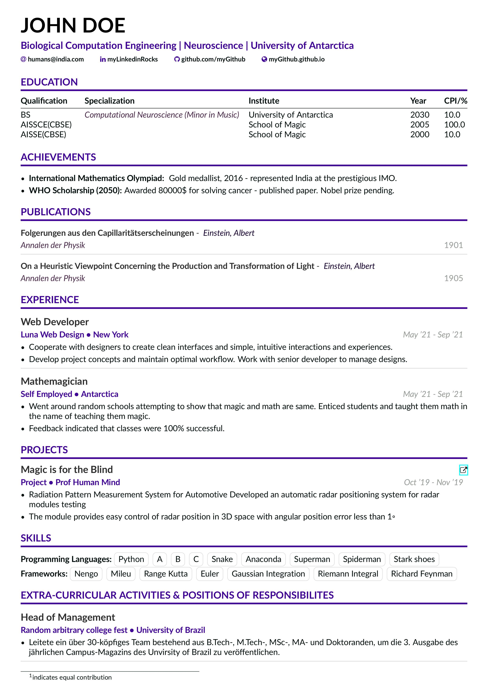

## Aesthetic Resume Template

This is a really nice looking CV that I modified heavily from a popular CV template that's floating on the web. 

The template is also heavily space efficient, but still looks vastly better than most CV's out there. It's perfectly usable for any kind of opportunity, be it academic or industrial.

I can bet that you can never figure out it's made on LaTeX until someone told you.

Leave a star if you like it :)

## Usage

1. Download the entire repository as a zip file, and upload on overleaf.
2. Modify relevant sections under the `sections/` folder, and enjoy!

(or)

1. View this link : https://www.overleaf.com/read/nvzbtynxtwcf

2. Copy the project, and enjoy!
